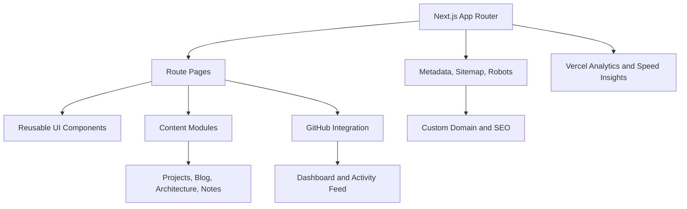

# CloudFolio

CloudFolio is a production-grade engineering portfolio for Narendra Pratap Singh, focused on cloud infrastructure, Site Reliability Engineering, platform engineering, DevOps, automation, and AWS work.

Production: https://cloudfolio-xi.vercel.app  
Repository: https://github.com/narendra09-devops/cloudfolio

## Project Overview

CloudFolio is built as a real product rather than a static resume page. It combines recruiter-focused content, technical case studies, architecture notes, GitHub activity, resume downloads, analytics, SEO metadata, and production hardening in one maintainable Next.js application.

Primary audiences:

- Recruiters evaluating cloud infrastructure, SRE, platform, AWS, and DevOps roles.
- Hiring managers reviewing project evidence and technical communication.
- Engineers reviewing architecture, operational practices, and implementation quality.

## Major Features

- Recruiter Hub with role fit, skills, relocation preferences, featured projects, FAQ, resume downloads, and direct contact paths.
- Project portfolio with case studies for cloud security, cost optimization, VM audit automation, SSL automation, dashboards, backlog reduction, and SRE automation.
- Discovery search and filters across projects, blog posts, and architecture topics with query-param support for recruiters who want to narrow quickly.
- VM Audit flagship case study with business context, implementation narrative, metrics, gallery, and architecture flow.
- Resume page with view/download CTAs and analytics events.
- Blog and architecture gallery content systems.
- GitHub-powered dashboard and activity feed with graceful fallback states.
- Vercel Analytics and Speed Insights integration.
- Custom-domain-ready SEO, sitemap, robots, metadata, and redirects.
- Security headers configured through Next.js for Vercel compatibility.

## Tech Stack

- Framework: Next.js 15 App Router
- UI: React 19, TypeScript
- Styling: Tailwind CSS
- Motion: Framer Motion
- Icons: Lucide React
- Charts: Recharts
- Theme: next-themes
- Content: TypeScript content modules and MDX support
- Analytics: Vercel Analytics, Vercel Speed Insights
- Testing: Vitest, Testing Library, Playwright configuration
- Quality: ESLint, Prettier, TypeScript, Husky, lint-staged
- Deployment: Vercel

## Architecture



Key directories:

```text
src/
├── app/              Route handlers, pages, metadata, sitemap, robots
├── components/       UI, layout, sections, project, blog, GitHub components
├── config/           Site and navigation configuration
├── content/          Projects, blog posts, architecture topics, notes
├── lib/              GitHub integration, analytics, utilities
├── styles/           Global styles
└── constants/        Design constants
```

## Local Setup

Prerequisites:

- Node.js 22.x
- npm 10.x

Install dependencies:

```bash
npm install
```

Create local environment values:

```bash
cp .env.example .env.local
```

Run the development server:

```bash
npm run dev
```

Open:

```text
http://localhost:3000
```

## Validation

Run the full quality gate before release:

```bash
npm run format:check
npm run lint
npm run typecheck
npm run test -- --run
npm run build
```

## Deployment

CloudFolio is deployed on Vercel.

Production environment variables:

```bash
NEXT_PUBLIC_SITE_URL=https://cloudfolio-xi.vercel.app
NEXT_PUBLIC_DOMAIN=cloudfolio-xi.vercel.app
NEXT_PUBLIC_GITHUB_USERNAME=narendra09-devops
NEXT_PUBLIC_VERCEL_ANALYTICS=true
```

Optional GitHub API token:

```bash
GITHUB_TOKEN=<token>
```

`GITHUB_TOKEN` improves GitHub API reliability and rate limits for dashboard and activity data. The application falls back gracefully when GitHub data is unavailable.

## Analytics

CloudFolio uses Vercel Analytics and Vercel Speed Insights.

Tracked events include:

- Resume viewed
- Resume downloaded
- Recruiter Hub viewed
- Contact email clicked
- LinkedIn clicked
- GitHub clicked
- Project CTA clicked
- VM Audit case study viewed

Disable analytics locally with:

```bash
NEXT_PUBLIC_VERCEL_ANALYTICS=false
```

## Custom Domain

The app supports custom-domain migration through environment variables:

```bash
NEXT_PUBLIC_SITE_URL=https://<canonical-domain>
NEXT_PUBLIC_DOMAIN=<canonical-domain>
```

No final domain is hardcoded. See [docs/CUSTOM_DOMAIN_SETUP.md](docs/CUSTOM_DOMAIN_SETUP.md) for DNS, Vercel, SSL, redirect, sitemap, Search Console, and analytics verification steps.

## Screenshots

Recommended production screenshots for release assets:

| Page                | URL                                      | Purpose                                 |
| ------------------- | ---------------------------------------- | --------------------------------------- |
| Home                | `/`                                      | Portfolio overview and primary CTAs     |
| Recruiter Hub       | `/recruiter`                             | Recruiter-ready profile and downloads   |
| VM Audit Case Study | `/projects/vm-audit-automation-platform` | Flagship case study evidence            |
| Dashboard           | `/dashboard`                             | GitHub integration and activity widgets |
| Contact             | `/contact`                               | Recruiter contact paths                 |

## Roadmap

v2 planning is maintained in [docs/ROADMAP_v2.md](docs/ROADMAP_v2.md).

High-priority next improvements:

- Add automated route and link checks.
- Add Playwright smoke tests for recruiter, resume, contact, and project flows.
- Add committed production screenshots for README and release pages.
- Add richer per-page structured data.
- Add Lighthouse CI for production score tracking.
- Expand the discovery layer with saved searches, sort controls, and analytics on filter usage.

## Documentation

- [Release Notes v1](docs/RELEASE_NOTES_v1.md)
- [Release Notes v1.2](docs/V1_2_RELEASE_NOTES.md)
- [Launch Checklist](docs/LAUNCH_CHECKLIST.md)
- [Production Scorecard](docs/PRODUCTION_SCORECARD.md)
- [Known Limitations](docs/KNOWN_LIMITATIONS.md)
- [Custom Domain Setup](docs/CUSTOM_DOMAIN_SETUP.md)
- [Launch Announcement](docs/LAUNCH_ANNOUNCEMENT.md)

## License

CloudFolio is licensed under the MIT License. See [LICENSE](LICENSE) for details.
